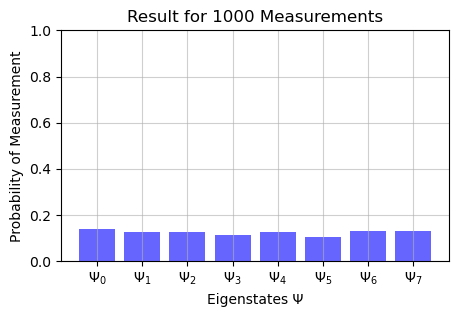
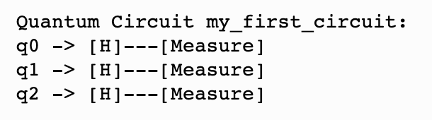
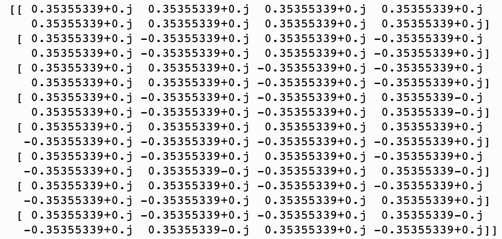
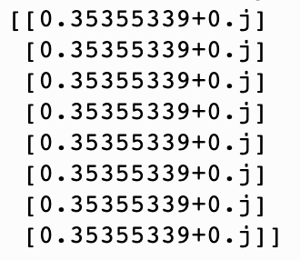

<p align="center">
  <a href="addlinktopage" rel="noopener">
</p>

<h3 align="center">Quantum Computing Simulator Project</h3>

---

<p align="center"> This a program which allows you to simulate a quantum computer and make quantum circuits and algorithms 
    <br> 
</p>

<!-- ## Table of Contents
- [Table of Contents](#table-of-contents)
- [Getting Started ](#getting-started-)
  - [Prerequisites](#prerequisites)
  - [Installing](#installing)
- [Usage ](#usage-)
- [Authors ](#authors-) -->

<!-- ## About <a name = "about"></a>
A python progrom to simulate quantum computing on a classical computer. -->

## Getting Started <a name = "getting_started"></a>

### Prerequisites
This program is self contained and uses matplotlib for plotting graphs.

### Installing
This program can be used by downloading the file quantum_simulator.py and importing into your file:

```
from quantum_simulator import *
```

### How to Use 
This section will show you how to the quantum simulator program through an example.


Creating a quantum register of 3 qubits, initialised to state 0:

```
qregister = state(3, 0)
```

Creating a quantum circuit:

```
circuit = programmer(qregister, name="my_first_circuit")
```

Applying Hadamard gates to each of the qubits in the circuit:

```
circuit.add_step([H,H,H])
```

Compile and run the circuit:

```
circuit.compile()
circuit.run()
```


Measure the state of the quantum register and plot the resuts:
```
circuit.measure()
```
 


Print a visualisation of the circuit:
```
print(circuit)
```
 


Print the gates as a matrix:
```
print(circuit.get_matrix())
```
 


Print the amplitudes of the quantum register:
```
print(circuit.output)

```
 


## Authors <a name = "authors"></a>
Jordi Zhang,
Elena Espinosa,
Alexandra McAdam,
Taewoo Lee,
Kathryn Griggs,
Matilda Lawton.


